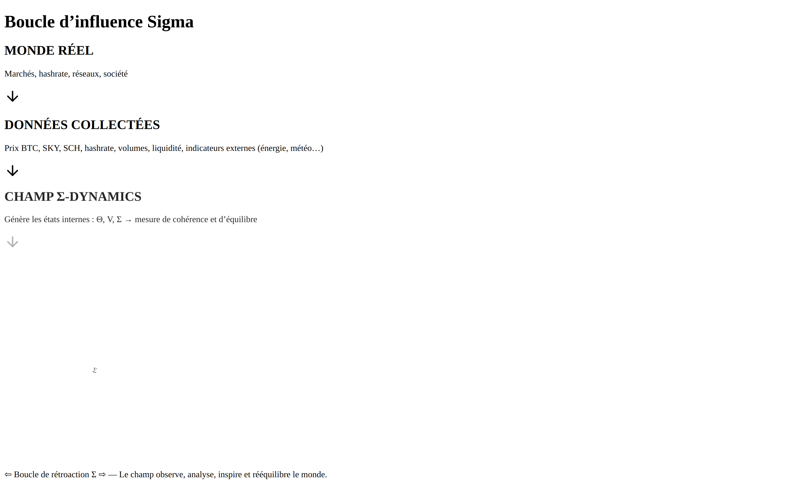

# 🧠 Sigma-Dynamics (v0.1)

> Experimental simulation engine for the **Sigma-Lab Framework**, developed by **DeepKang-Labs**.  
> Models adaptive moral coherence through the canonical loop:  
> θ → C → M → θ

---

## Boucle d’influence Sigma



> Visuel auto-généré par `.github/workflows/export-visual.yml`.

## ⚛️ Concept

Sigma-Dynamics implements the **Theory of Algorithmic Moral Relativity**,  
a system where ethics evolves dynamically under semantic and contextual pressure.

### Canonical Equations

\[
\theta_i(t) = f_i(E_t, M_{t-1})
\]
\[
M_t = \sum_{k=1}^{n} w_k \cdot C_k
\]
\[
\overline{C}_t = \frac{1}{n}\sum_{k=1}^{n} C_k
\]

---

## ⚙️ Installation & Execution

```bash
pip install -r requirements.txt
python sigma_dynamics.py

Artifacts (CSV + Plots) will be generated under:

/sigma_dynamics_artifacts_YYYYMMDD-HHMMSS/


---

🧩 Output Examples

coherence_over_time.png

theta_non_harm_over_time.png

veto_over_time.png

log.csv (complete record of simulation steps)


---

🌐 Project Context

Sigma-Dynamics is part of the larger Sigma-Lab Framework ecosystem:

Sigma-Lab-Framework → Theoretical & Mathematical Core

Sigma-Dynamics → Simulation & Validation Engine


---

🧑‍💻 Contributors

Yuri Kang — Architect of the Axiom-to-Code Paradigm

IA Kang — Design & Engineering Logic

DeepSeek, Gemini — Theoretical & Review Partners


© 2025 DeepKang-Labs · Axiom to Code
